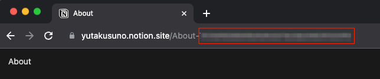
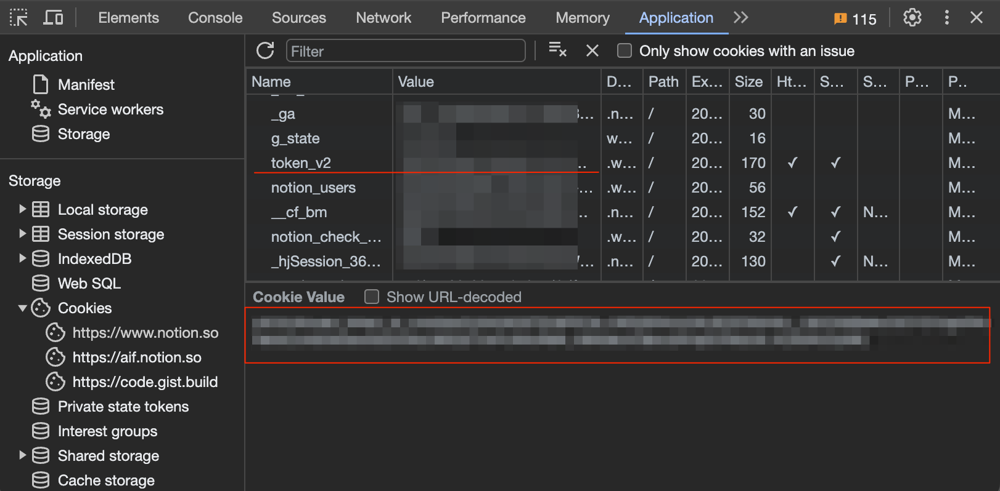

# portfolio-website

## Technologies

- TypeScript
- Next.js 13
- Notion

## Quick Start

### Clone

Clone this project locally and move to the project root directory

```
git clone git@github.com:yutakusuno/portfolio-website.git
cd portfolio-website
```

### Install dependencies

```
yarn install
```

### Environment variables

Create .env.local in the root directory

```
touch .env.local
```

Set the following environment variables with yours to .env.local

```
NOTION_BLOG_DATABASE_ID=xxxxyyyyzzzz
NOTION_ABOUT_PAGE_ID=xxxxyyyyzzzz
NOTION_EXPERIENCE_PAGE_ID=xxxxyyyyzzzz
NOTION_AUTH_TOKEN=xxxxyyyyzzzz
```

The \*\_ID is displayed on your notion page. Please copy the id in the red frame and paste it to the \*\_ID



The auth token is displayed on the Application tab of your Google Chrome. As you can see, the menu on the left side has the Storage section. Please go ahead, Storage > Cookies > https://www.notion.so. Then, click the token_v2, which is underlined. And copy your token in the red frame and paste it to your NOTION_AUTH_TOKEN.



### Host the project locally

```
yarn dev
```

## Deploy on Vercel

Before deploying on Vercel, please set the following environment variables on the vercel dashboard

```
NOTION_BLOG_DATABASE_ID
NOTION_ABOUT_PAGE_ID
NOTION_EXPERIENCE_PAGE_ID
NOTION_AUTH_TOKEN
```
